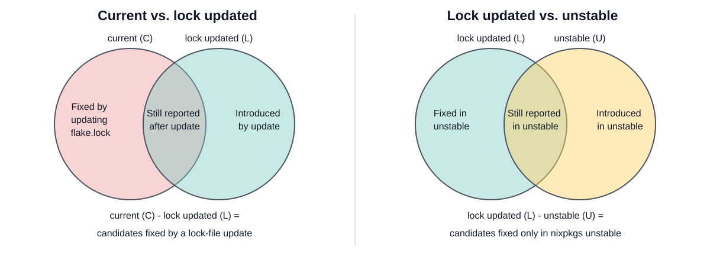

# Flakevuln: vulnerability monitoring for Nix flakes

`flakevuln` scans the buildtime dependency closures of selected Nix flake
outputs for known vulnerabilities. These closures also include the targets'
runtime dependencies. It is available as a GitHub Action for continuous
monitoring and as a local CLI for running the same workflow outside GitHub
Actions.

New advisories can be published for dependencies in a flake's buildtime closure
even when the repository has not changed. Regularly scanning the closure
therefore reveals changes in known vulnerabilities without requiring a source
or `flake.lock` change.

Its main value is the context around a finding. A Nix flake pins its inputs to
exact revisions, so `flakevuln` can compare the currently pinned target with
the same target evaluated against newer dependency revisions. The resulting
report separates findings that may be resolved by a routine lock-file update
from those that need further work.

A report answers five practical questions:

- Which publicly disclosed vulnerabilities are reported for the software as it
  is pinned now?
- Which findings would no longer be reported if the pinned nixpkgs input in
  `flake.lock` were updated?
- Which findings would no longer be reported if the flake used the latest
  revision from nixpkgs unstable?
- Which findings may require a nixpkgs fix or backport?
- Which findings are new since the previous successful scan?

Scanner results are candidates for review. They do not, on their own, prove
that a vulnerability is reachable or exploitable in the finished product.

## How a scan works

### Scan the selected output

The configuration names one or more flake outputs, such as a system image or
application package. Nix evaluates each output, exposing its reproducible
buildtime dependency graph.

`flakevuln` scans this full buildtime closure, which Nix can determine
without building the target. A runtime-only closure becomes known only after
Nix builds the output and records its store-path references. Scanning it would
therefore require building the target in each current, lock-updated, and
optional unstable state. The buildtime approach avoids those builds, but also
includes compilers, build tools, and bootstrap components that may not be
present in the shipped runtime and can require additional triage. See
[Buildtime vs Runtime Dependencies](https://github.com/tiiuae/sbomnix#buildtime-vs-runtime-dependencies)
for more detail.

`flakevuln` uses
[`vulnxscan`](https://github.com/tiiuae/sbomnix/blob/main/doc/vulnxscan.md) from
[`sbomnix`](https://github.com/tiiuae/sbomnix) for the underlying analysis.
`vulnxscan` derives Nix-aware software-bill-of-materials data and combines
results from Vulnix, Grype, and OSV. Repology supplies upstream-version
information used during triage.

Coverage is defined by the configured outputs. Scanning one deployable image
says which dependencies were found for that image; it does not imply that every
output or architecture in the repository was examined.

### Compare dependency states

For each output, `flakevuln` evaluates up to three dependency states:

| State | How it is produced |
| --- | --- |
| **Current (`C`)** | Use the flake's current `flake.lock` unchanged. |
| **Lock updated (`L`)** | Re-lock one selected input, normally `nixpkgs`, to the latest revision available from its configured reference. |
| **Unstable (`U`)** (optional) | Override the selected input with an explicit reference such as `github:NixOS/nixpkgs/nixos-unstable`. |

The report sections map these sets after patch-evidence and whitelist handling:

- **Currently Active Vulnerabilities**: the active findings in `C`.
- **Vulnerabilities Fixed by Updating Pinned nixpkgs**: `C - L`, the current
  findings that disappear after re-locking the selected input.
- **Vulnerabilities Fixed in nixpkgs Unstable**: `L - U`, the findings that
  remain after re-locking but disappear with the unstable input.

All re-locking takes place in a disposable snapshot. The scanned repository and
its `flake.lock` are not modified.

### Compare with the previous run

The GitHub Action keeps the last successful findings for the same flake
reference, target list, and selected input. On the next run it reports:

- **New Vulnerabilities Since Last Run** (Step Summary and full Markdown report):
  findings present now but not in the baseline. This includes newly disclosed
  CVEs as well as vulnerabilities introduced by dependency changes.
- **Vulnerabilities No Longer Active Since Last Run** (full Markdown report
  only): findings in the baseline but not active now. They may have been fixed,
  removed, or whitelisted.

The baseline is held in the GitHub Actions cache. It provides a useful rolling
comparison but is not a permanent history: cache eviction or a changed scan
scope can leave a run without a baseline. The report says when the comparison
was unavailable rather than showing zero changes.

### Keep the evidence needed for triage

The full Markdown report retains context needed for manual review:

- Per-derivation patch evidence shows whether a matched derivation has a patch
  whose file name mentions the vulnerability ID. Findings with mixed or
  incomplete evidence remain active and are marked for review.
- Optional enrichment adds `PR` links by searching nixpkgs pull requests for
  the vulnerability ID, and `TRACKER` links to Nixpkgs security tracker issues
  and their status. Both help with manual triage, but neither proves that a
  finding is fixed. PR matching in particular is heuristic and must be checked
  for relevance. A missing link does not show that nixpkgs is unaware of the
  issue.

When every matched derivation has a patch named after the vulnerability, the
finding is omitted from the active table but remains in the full report under
**Patched and Partially Patched Findings**. This is evidence of a backport, not
proof that the patch is complete. Conversely, a patch can carry the fix without
naming the CVE. The detailed evidence model is documented in
[Component evidence](component-evidence.md).

## Outputs

By default, a GitHub Actions run writes a Step Summary and uploads an artifact
containing the full Markdown report (`report/`) and `findings.json`. Throughout
this overview, **full report** refers to that Markdown report.

| Output | Intended use |
| --- | --- |
| **Step Summary** | The first operational view. It gives each target's active count and shows the main current, new, and update-comparison sections on the workflow run. |
| **Full Markdown report (`report/`)** | The complete human-readable report, including findings no longer active, whitelisted findings, patch evidence, scan errors, and skipped-comparison notes. |
| **`findings.json`** | The complete machine-readable result for archiving, dashboards, or integration with another system. |

A local run writes the same full report to `.flakevuln/report/` and the
machine-readable result to `.flakevuln/findings.json` by default.

## Using it in a vulnerability process

1. **Select flake output targets.** Configure one or more flake outputs for
   `flakevuln` to scan.
2. **Run scans regularly.** Run scans on your preferred schedule, for example
   daily or weekly.
3. **Review new findings.** Start with findings reported since the previous
   run. Severity can help order the review, but expect many scanner matches to
   be false positives. Common causes include ambiguous package names, incorrect
   or incomplete affected-version data, platform-specific advisories, fixes
   backported without an upstream version change, and advisories for components
   not present in the selected output.
4. **Manually triage findings.** Check the advisory against the actual package,
   version, target platform, included software, patch evidence, and related
   upstream information. Keep findings that apply active. For a confirmed false
   positive, add a narrowly scoped entry with the reasoning to the
   repository-owned whitelist CSV.
5. **Contribute to nixpkgs.** If a valid finding is not already tracked or
   addressed in nixpkgs, consider opening an issue or pull request. When the fix
   is available in nixpkgs unstable but not in the relevant release branch, this
   can mean helping the community backport it.

## Operational notes

The recommended CI integration is the composite GitHub Action. A minimal setup
requires a checkout, one or more target names, and read-only contents
permission. The local CLI runs the same scan and report workflow outside GitHub
Actions. Configuration examples are in the main [README](../README.md#github-action).

Detected vulnerabilities do not by themselves fail the command or GitHub
Action; they are reported for monitoring and manual triage.

The action separates untrusted evaluation from authenticated enrichment. The
flake is evaluated and scanned without `GH_TOKEN`; the token is provided only
to the later report phase for optional GitHub lookups.

Run time is mainly determined by the target scans and optional report
enrichment. Every target is scanned in the current and lock-updated states;
enabling the unstable comparison adds a third full scan. This work scales with
the size of the dependency closures.

The `nixprs` action option (`--nixprs` in the CLI) performs rate-limited GitHub
searches for actionable vulnerability IDs to add candidate nixpkgs pull request
links. The `nixtracker` option (`--nixtracker`) queries the Nixpkgs security
tracker to add issue links and status. Its first uncached lookup may need to
walk the tracker's full paginated issue list and take several minutes. On a
report with many findings, these lookups can dominate the run time.

Both enrichment options are disabled by default and can be omitted entirely.
They add context for manual triage but do not change the detected findings or
dependency-state comparisons. Tool databases and lookup responses are cached
between runs. Scheduled runs should use different cron minutes across
repositories to avoid sending a burst of requests to shared community
services.
